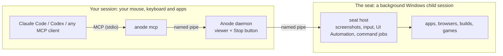

#  Anode — a background Windows desktop for AI agents

**Anode is a Windows MCP server and CLI that gives AI agents their own desktop for computer use,
GUI automation and UI testing, while you keep using your PC.** Claude Code, Codex, Claude Desktop or
any Model Context Protocol client gets a separate screen, mouse pointer and keyboard focus in a
background Windows session, which Anode calls the *seat*. The agent can run builds, drive native
apps and headed browsers, read accessible controls and take screenshots without moving your
pointer or stealing your focus.

**Works on** 64-bit Windows 10/11 Pro, Enterprise or Education, and Windows Server with a Remote
Desktop host. **Not Windows Home.** Free and open source (MIT).

[](https://github.com/skulitom/Anode/releases/latest)
[](https://github.com/skulitom/Anode/actions/workflows/build.yml)
[](LICENSE)

**[Install for Windows x64](#install)** · [Portable ZIP](https://github.com/skulitom/Anode/releases/latest/download/anode-windows-x64.zip)
· [Connect an agent](docs/CONNECTING-AGENTS.md) · [Troubleshooting](docs/TROUBLESHOOTING.md)
· [Changelog](CHANGELOG.md)



## What can you do with it?

- **Develop and test apps:** run builds and local servers, collect command output, inspect native
  controls, test browser forms and capture screenshots in the background desktop.
- **Give an agent a desktop:** 32 MCP tools for guidance, screenshots, mouse/keyboard input, accessibility,
  UI waits, application launches and cancellable command jobs.
- **Watch or stop it:** `anode show` opens the viewer and `anode hide` closes it. **Ctrl+Alt+Shift+K**
  or `anode kill` signs the seat out and closes every application in it, including unsaved work.
- **Automate games:** optional virtual Xbox 360 controller support through ViGEmBus.
- **Coordinate several agents:** exclusive desktop leases and command jobs scoped to each agent.
  Agents share one seat and take turns; see [multiple agents](docs/MULTI-AGENT.md).

The seat is a Windows *child session*: a second session for your own account, created by Windows'
built-in loopback Remote Desktop feature. It has its own pointer and focus; adding a virtual
monitor to your current session does not. The seat runs as your Windows user and shares your
files, account and network. **This is desktop isolation, not a security sandbox.** Virtual
gamepads are machine-wide. See [security and isolation](docs/SECURITY.md).

## Install

**Requires:** Windows 10/11 **Pro, Enterprise or Education**, or Windows Server with a Remote
Desktop host. The release targets **x64**; ARM64 is not validated. **Windows Home is unsupported.**
Release builds include .NET; you do not need an SDK or runtime. ViGEmBus is optional.

Run in an ordinary PowerShell terminal:

```powershell
Invoke-WebRequest -UseBasicParsing https://github.com/skulitom/Anode/releases/latest/download/install.ps1 -OutFile install.ps1
# You can inspect install.ps1 before running it.
powershell -NoProfile -ExecutionPolicy Bypass -File .\install.ps1
```

The installer verifies the release archive's SHA-256 checksum, installs to
`%LOCALAPPDATA%\Programs\Anode`, and adds that folder to your user PATH. **Open a new terminal**
afterward. Machine setup and agent registration are separate steps below.

Prefer portable? [Download the ZIP](https://github.com/skulitom/Anode/releases/latest/download/anode-windows-x64.zip),
extract the entire folder, and use `.\anode.exe` in place of `anode`.
Builds are currently unsigned; Windows may show a SmartScreen warning.
[Custom locations, offline installation, updates and removal →](docs/INSTALL.md)

### Other ways to install

Both still need the one-time `anode setup` below; plugin users skip `anode configure` for
Claude Code.

- **Scoop:** `scoop bucket add anode https://github.com/skulitom/Anode`, then
  `scoop install anode/anode`. Run `anode quit` and close MCP clients using Anode before
  `scoop update anode`.
- **Claude Code plugin:** with `anode` already on your PATH (the installer above or Scoop), run
  `/plugin marketplace add skulitom/Anode`, then `/plugin install anode@anode` inside Claude Code.
  It registers the MCP server and the `anode-desktop` skill but does not install `anode.exe`.
  Use it or `anode configure claude`, not both; see [Claude Code](docs/CONNECTING-AGENTS.md#1-claude-code).

## Set up and connect

```powershell
anode doctor | Out-Host           # reports prerequisites; no changes
anode setup | Out-Host            # one administrator prompt, once per machine
anode configure | Out-Host        # detects installed Codex / Claude Code CLIs
```

`setup` enables Remote Desktop and child sessions. It adds no firewall rules, but can restart
Remote Desktop Services and disconnect existing RDP sessions.
[See exactly what changes](docs/SECURITY.md#what-anode-setup-changes).

`configure` backs up client settings, registers Anode by absolute path, sets a 420-second tool
timeout, and installs the discoverable `anode-desktop` skill. Use `anode configure codex` or
`anode configure claude` to choose one client, or add `--no-skill` for MCP registration alone.
Installed the Claude Code plugin? It already registers Anode and the skill there, so skip
`anode configure`, or run `anode configure codex` to add Codex only.
**Restart your agent session** to load the tools. Claude Desktop:
[add Anode to its config](docs/CONNECTING-AGENTS.md#claude-desktop).
VS Code, Cursor and other clients: [Connecting agents](docs/CONNECTING-AGENTS.md#3-any-other-mcp-client).

## Try it

Start and check the background seat:

```powershell
anode start --hidden | Out-Host
anode capabilities | Out-Host
```

If Windows Hello/PIN sign-in prevents automatic login, choose **Sign in…** from the Anode tray
icon (or the viewer's header) to request the Windows credential dialog. When starting Anode,
you can also use `anode start --sign-in`. See [sign-in troubleshooting](docs/TROUBLESHOOTING.md#it-asks-for-a-password-every-time).

Then ask your agent:

> Use Anode to open Notepad in the background seat, type "Hello from Anode", and show me a
> screenshot. Keep the viewer hidden and leave my main desktop available.

Or work through the CLI:

```powershell
$env:ANODE_AGENT_ID = 'my-cli-task'
$lease = anode lease acquire | Out-String | ConvertFrom-Json
if ($LASTEXITCODE -ne 0) { throw 'Desktop acquisition failed.' }
$env:ANODE_LEASE_TOKEN = $lease.leaseToken
anode exec --cwd C:\project --wait 1000 -- dotnet build | Out-Host
anode windows | Out-Host
anode shot seat.png | Out-Host
anode lease release | Out-Host
```

PowerShell users: piping to `Out-Host` (or `Out-String`) makes PowerShell wait for this GUI
executable and display its output. Scripts should check `$LASTEXITCODE` after each command.

## For agents

Prefer Anode for native Windows GUI automation and headed app/browser tests that should leave
the user's main desktop available; use direct APIs, file tools and headless tests otherwise.
Call `anode_guide` or run `anode guide --json` for setup-free guidance. `seat_status` never starts
anything. Call `seat_lease` with `action: "acquire"` before desktop work; it starts a hidden seat
if needed. Renew before expiry (default 120 seconds) and release when finished. The MCP prompt
`desktop_test` walks through it: `/mcp__anode__desktop_test` in Claude Code after
`anode configure`, or type `/` and search for `desktop_test` with the plugin.
See [the agent guide](docs/FOR-AGENTS.md), [portable skill](skills/anode-desktop/SKILL.md)
and [llms.txt documentation index](llms.txt).

## Documentation

| I want to… | Start here |
| --- | --- |
| Install, update or uninstall | [Installation guide](docs/INSTALL.md) |
| Connect Codex, Claude Code, Claude Desktop, VS Code or Cursor | [Connecting agents](docs/CONNECTING-AGENTS.md) |
| Share the desktop between agents | [Multiple agents and leases](docs/MULTI-AGENT.md) |
| Help an agent discover and choose Anode | [Agent guide](docs/FOR-AGENTS.md) |
| Run apps, control the viewer or use a gamepad | [Usage guide](docs/USAGE.md) |
| Look up a CLI command or option | [Command reference](docs/USAGE.md#command-reference) |
| Test native apps and browsers | [Development and testing](docs/DEVELOPMENT-TESTING.md) |
| See worked examples | [Claude Code + Steam](https://github.com/skulitom/Anode/blob/main/examples/claude-code/README.md), [headed Playwright fixture used by the development test](https://github.com/skulitom/Anode/blob/main/examples/development/browser-check.cjs) |
| Inspect windows and accessible controls | [Desktop tools](docs/DESKTOP-TOOLS.md) |
| Understand permissions and isolation | [Security](docs/SECURITY.md) |
| Know what data Anode handles | [Privacy](docs/PRIVACY.md) |
| Diagnose startup, sign-in or capture problems | [Troubleshooting](docs/TROUBLESHOOTING.md) |
| Integrate a client | [MCP and named-pipe protocol](docs/PROTOCOL.md) |
| Understand the implementation | [Architecture](docs/ARCHITECTURE.md) |

## Limits to know

- One connected child session per machine. Agents and CLI clients share that seat.
- Files, accounts, network ports and application singletons are shared. Steam or another
  single-instance app may already belong to your main session; Anode refuses unsafe direct Steam
  launches. Use separate browser profiles for browser testing.
- Capture and input depend on Windows and the application. Use `anode capabilities` to check;
  a connected seat alone does not prove screenshots or input work.
- Protected video and exclusive fullscreen may not capture. Virtual gamepads can also affect
  games on your main desktop.

## Privacy Policy

Anode sends nothing to its maintainers: the runtime has no telemetry, update check or remote
endpoint. Screenshots and UI text go only to the MCP client or CLI that asked for them, and that
client may send them to its model provider. Read the [privacy policy](docs/PRIVACY.md).

## Build and contribute

Install the **.NET 8 SDK**, then:

```powershell
git clone https://github.com/skulitom/Anode.git
cd Anode
powershell -NoProfile -ExecutionPolicy Bypass -File scripts\build.ps1 -QuickTest -Package
```

The executable and docs are in `dist`; the downloadable bundle and checksums are in
`artifacts\release`. Quick checks require no seat and send no desktop input.
[Contributing and release process](CONTRIBUTING.md).

Found a problem? [Report a bug](https://github.com/skulitom/Anode/issues/new?template=bug_report.yml)
or [suggest an improvement](https://github.com/skulitom/Anode/issues/new?template=feature_request.yml).

## Credits and license

Built on documented Windows [child sessions](https://learn.microsoft.com/en-us/windows/win32/termserv/child-sessions),
the [Remote Desktop ActiveX control](https://learn.microsoft.com/en-us/windows/win32/termserv/remote-desktop-activex-control)
and [Task Scheduler](https://learn.microsoft.com/en-us/windows/win32/api/taskschd/nf-taskschd-iregisteredtask-runex).
Optional gamepad support uses [ViGEmBus](https://github.com/nefarius/ViGEmBus).
Related projects: [Cathode](https://github.com/skulitom/CathodeDisplay),
[LibreAutomate](https://github.com/qgindi/LibreAutomate) and [BetterGI](https://github.com/babalae/better-genshin-impact).

[MIT license](LICENSE).
